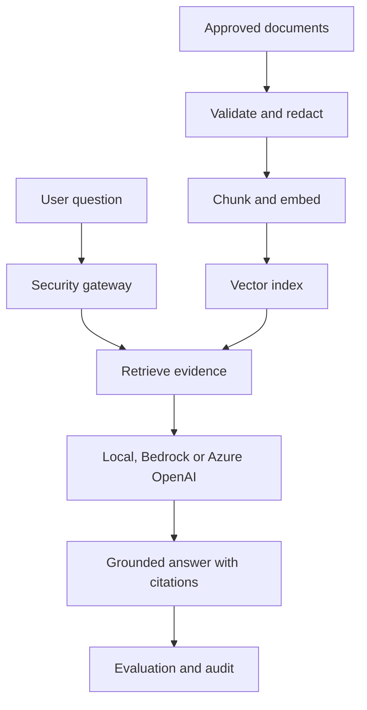

# Enterprise Multi-Cloud GenAI RAG Platform

[](https://github.com/josepharayemi-netizen/enterprise-genai-rag-platform/actions/workflows/ci.yml)
[](https://github.com/josepharayemi-netizen/enterprise-genai-rag-platform/actions/workflows/security.yml)
[](CITATION.cff)
[](https://doi.org/10.5281/zenodo.23045245)

A secure, observable and governed Retrieval-Augmented Generation platform. It runs locally without paid APIs and provides production deployment paths for Amazon Bedrock and Azure OpenAI.

## What this demonstrates

| Capability | Evidence |
|---|---|
| GenAI engineering | Grounded answers, citations, prompt contracts and provider adapters |
| RAG/data engineering | Ingestion, chunking, deterministic embeddings, vector retrieval and lineage |
| LLMOps | Golden-set evaluation, faithfulness checks, prompt versioning and quality gates |
| AI security | Prompt-injection detection, PII redaction, allowlisted sources and output filtering |
| Responsible AI | Human-review boundary, risk register, model card and NIST AI RMF mapping |
| Cloud architecture | Terraform references for AWS Bedrock and Azure OpenAI |
| DevSecOps | Docker, Kubernetes, Helm, Argo CD, CI, SBOM and vulnerability scanning |
| Observability | OpenTelemetry-ready traces, Prometheus metrics, audit events and SLOs |

## Architecture



## Local quick start

```bash
python -m venv .venv
source .venv/bin/activate  # Windows: .venv\Scripts\activate
pip install -r requirements.txt
python -m src.rag_platform.cli ingest examples/knowledge
uvicorn src.rag_platform.api:app --host 0.0.0.0 --port 8000
```

Open <http://localhost:8000/docs> and call `POST /v1/query`:

```json
{"question":"How are production deployments approved?","tenant_id":"demo"}
```

Local mode is deliberately deterministic: it extracts an answer from retrieved evidence instead of calling an external model. This makes the repository testable without credentials or cloud charges.

## Evaluation

```bash
python -m src.rag_platform.cli evaluate evaluation/golden_set.json
python -m src.rag_platform.cli experiment evaluation/candidate_test_set.json --repeats 5 --output evaluation/results/local_candidate_test.json
python -m src.rag_platform.cli security-evaluate evaluation/security_robustness_v2.json
```

The evaluation gate measures retrieval hit rate, citation coverage, abstention and injection blocking. Cloud promotion should occur only when the checked-in thresholds pass.

## Research and citation

The repository includes a [research protocol](research/PROTOCOL.md), a 20-case development benchmark, a frozen 40-case [candidate test set](evaluation/candidate_test_set.json), committed [local experiment results](evaluation/results/local_candidate_test.json), a working [manuscript](paper/manuscript.md), verified [BibTeX references](paper/references.bib), and machine-readable citation metadata in [`CITATION.cff`](CITATION.cff). The candidate set is synthetic and not independently annotated; it is not presented as an external benchmark. Tables marked `TBD` remain unmeasured.

Post-baseline security hardening is evaluated separately with 24 adversarial and 12 benign-control cases in [`security_robustness_v2.json`](evaluation/security_robustness_v2.json). The committed result reports both attack recall and benign specificity and preserves all failures.

Independent reviewers can use the blinded [human-annotation workflow](evaluation/annotation/ANNOTATOR_GUIDE.md). The pack excludes expected labels, and the agreement command reports raw agreement and Cohen's kappa before adjudication.

Version 1.0.0 is permanently archived on Zenodo: [https://doi.org/10.5281/zenodo.23045245](https://doi.org/10.5281/zenodo.23045245).

### Cite this software

> Arayemi, J. (2026). *Enterprise Multi-Cloud GenAI RAG Platform* (Version 1.0.0). Zenodo. https://doi.org/10.5281/zenodo.23045245

Machine-readable citation metadata is available in [`CITATION.cff`](CITATION.cff).

## Cloud providers

- **AWS:** Bedrock runtime, OpenSearch Serverless, KMS, S3 and CloudWatch with short-lived IAM identity.
- **Azure:** Azure OpenAI, AI Search, Key Vault, Storage and Application Insights with managed identity.

Terraform is intentionally plan-only until an operator supplies an account, approved models, private networking, budgets and deployment approval.

## Repository map

```text
src/             secure RAG, API, ingestion and evaluation
tests/           unit, security and quality-gate tests
evaluation/      versioned golden dataset
deploy/          Kubernetes and Helm packaging
gitops/          Argo CD desired state
terraform/       AWS and Azure reference architectures
observability/   Prometheus configuration
docs/            architecture, governance, threat model and runbook
```

## Safe-use boundary

This is a portfolio reference implementation using synthetic documents. It is not approved for medical, legal, financial, employment or other consequential decisions. Production use requires identity integration, tenant-isolated storage, representative evaluation, privacy review and named human accountability.

## License

MIT
